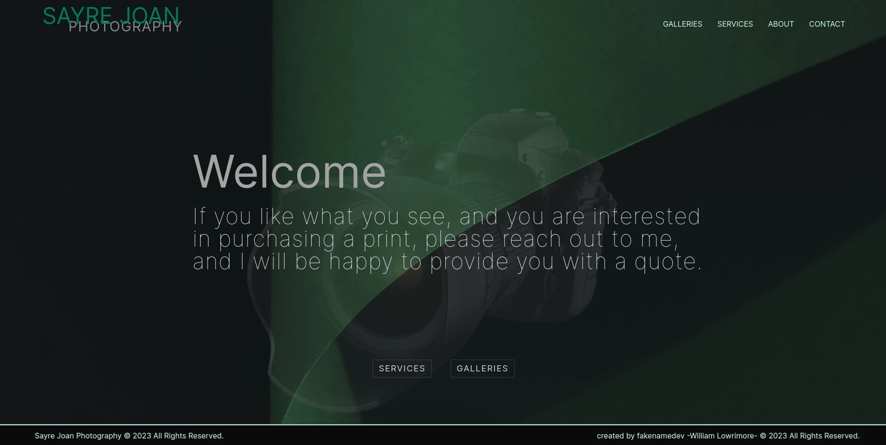
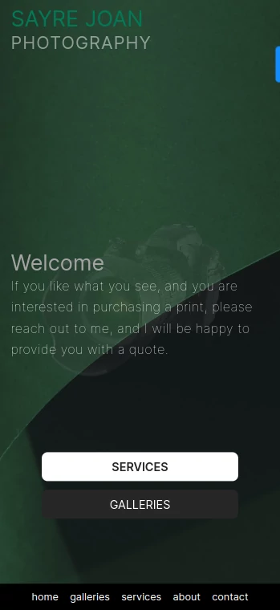

# Sayre Joan Photograpy

### Here is a React JS portfolio style single page parallax scrolling website. The original version of this site looks nothing like this. It was an HTML, CSS, JavaScript and jQuery website. The theme was dark and depressing. I took the same concept and built this version out using `npx create-react-app`, added TailwindCSS, and some other packages. React Hooks make this site dynamic and animated. 

Although I am using Tailwind, I also used some vanilla CSS to shorten down main code by saving some inline styling space.
This site is mobile responsive, neatly organized, and follows naming convention best practices.

see it on <a href='https://sayrejoanphotograpy.vercel.app/' target="_blank" rel="noopener noreferrer">VERCEL.</a>

## Contact Me

[wlowrimore@gmail.com](mailto://wlowrimore@gmail.com) 
[www.williamlowrimore.com](https://www.williamlowrimore.com)
